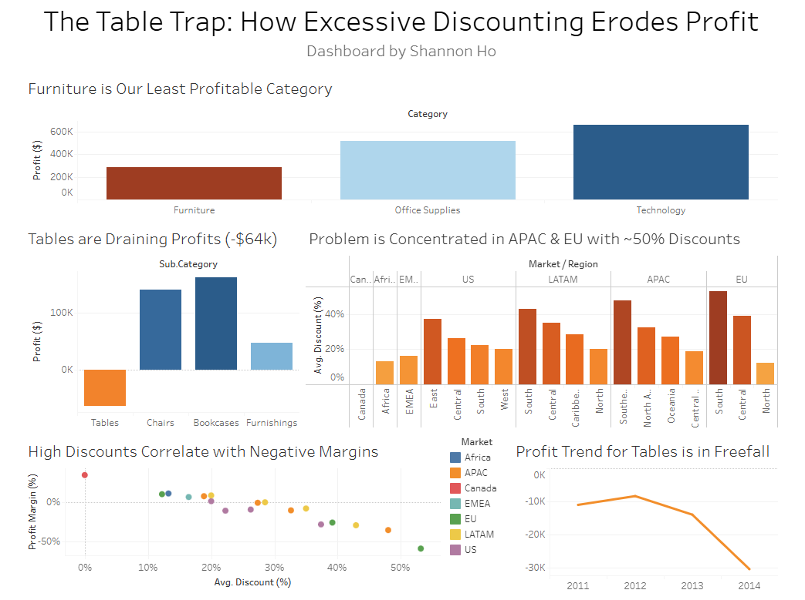
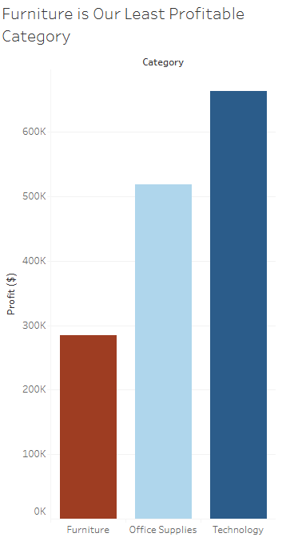
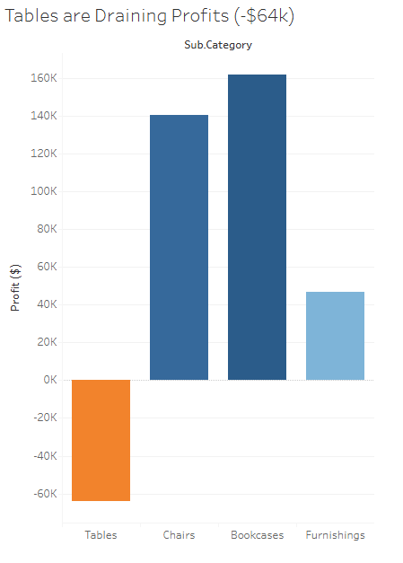
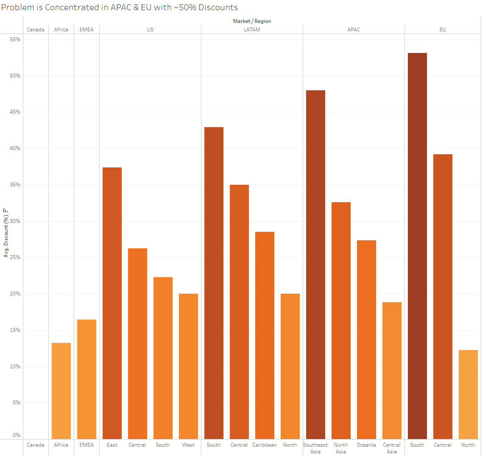
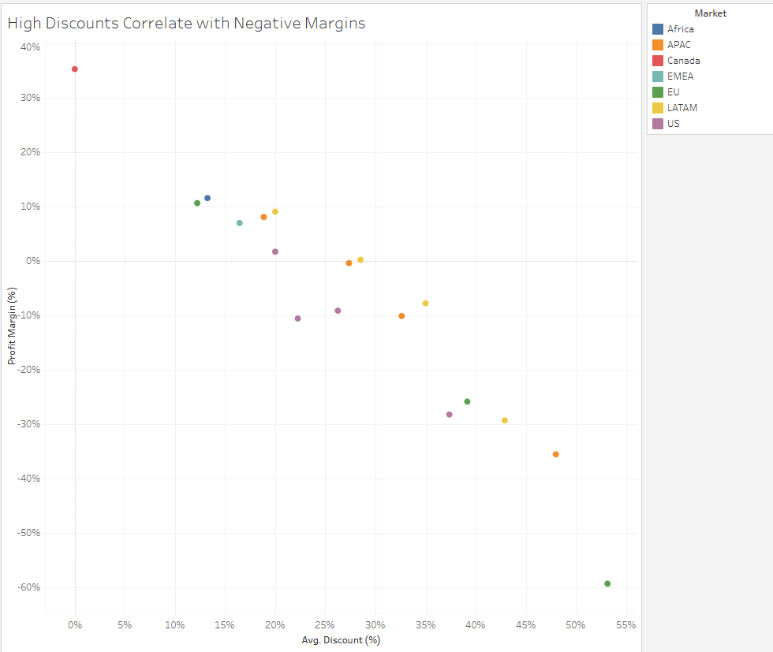
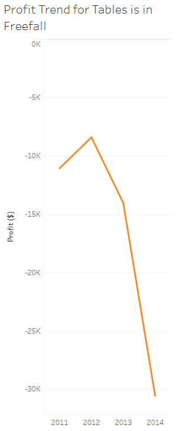

# Superstore Sales Analysis: Diagnosing a Profitability Crisis

## Overview
This project identifies the root cause of a $64k profitability crisis. It leverages SQL for deep analysis and Tableau for clear, actionable storytelling, fulfilling the objective of turning raw data into a strategic business tool.

## **Project Assets**

**The Table Trap: How Excessive Discounting Erodes Profit:** 

[**View the Interactive Dashboard on Tableau Public**](https://public.tableau.com/views/TheTableTrapHowExcessiveDiscountingErodesProfit/TheTableTrapHowExcessiveDiscountingErodesProfit?:language=en-US&:sid=&:redirect=auth&:display_count=n&:origin=viz_share_link)  

**Full Code & Analysis:** 

[View Jupyter Notebook on GitHub](./analysis/superstore_analysis.ipynb)  

---
## Objective
Analyze the Superstore dataset to find key business insights and translate them into actionable recommendations, backed by data analysis and supported by an interactive dashboard.

## Guiding Business Questions
My analysis was driven by these key questions:
- Is our most profitable category also our most efficient?
- Why does the Furniture category have significantly lower margins than Technology and Office Supplies?
- Is the profitability issue universal, or is it concentrated in specific markets?
- What is the relationship between discount levels and profit margin?

## Process & Methodology
1.  **Data Engineering:** Used Python and Pandas to load raw CSV data into a SQLite database for querying.  
2.  **Data Cleaning:** Created a SQL script to clean data, handle encoding issues, and create a clean dataset.
3.  **Analysis:** Created SQL queries focusing on profitability by category, sub-category, and region, and the impact of discounting on profit margins
4.  **Visualization:** Built a Tableau dashboard to translate these SQL insights into a clear business narrative.

## Key Findings
1.  **The Core Problem:** The Tables sub-category is operating at a significant loss (-8.47% margin), costing the company over $64,000.
2.  **Geographic Concentration:** These losses are highly concentrated in specific markets, notably **EU South** (-59.27% margin) and **APAC Southeast Asia** (-35.50% margin).
3.  **Root Cause:** A direct correlation was found between excessive discounting (averaging 50% in the worst-performing markets) and catastrophic profit losses.

### 1. Furniture is Our Least Profitable Category  
  
*Furniture profit is signficantly lower compared to Technology and Office Supplies, signaling a deep-rooted issue.*  

### 2. Tables are Draining Profits (-$64K)  
  
*The Tables product from Furniture was responsible for a massive -$64K profit loss, single-handedly eroding the entire category's profitability.*  

### 3. Problem Concentrated in APAC & EU with ~50% Discounts  
  
*Losses were concentrated in EU South and APAC Southeast Asia markets, where discount rates averaged 50%.*  

### 4. High Discounts Correlate with Catastrophic Margins  
  
*A clear negative correlation was found: higher discounts directly correlated with lower profit margins, revealing the strategy was unsustainable.*  

### 5. Profit Trend for Tables is in Freefall  
  
*The problem was accelerating over time, with profitability for Tables entering a freefall in 2013, meaning there needs to be a change.*  

## Strategic Recommendations 
Based on the analysis, the following actions are recommended to management:
- **Immediate Action:** Implement a strict maximum discount threshold for Tables in the EU South and APAC SEA markets to immediately stop the financial losses.
- **Sales Strategy Review:** Launch a training program for sales teams in these regions focused on value-based selling. Simultaneously, review sales targets and commissions to ensure they incentivize profitability, not just revenue.
- **Long-Term Strategy:** Conduct a full review of the Tables product line in these markets to assess its long-term viability and explore alternatives like cost reduction or product substitution.

## Potential Business Impact
If implemented, these recommendations could:
- **Reduce an annual loss of over $64,000** from the Tables product line. 
- **Improve profit margins** across the Furniture category by addressing its primary drain.
- **Create a more sustainable pricing strategy** that prioritizes profitability over volume.

---

## Tools Used
- **Python** (Pandas)
- **SQL** (SQLite)
- **Tableau** 
- **Jupyter Notebook** 

## Data Source
- Modified [**Kaggle** "Superstore" dataset](https://www.kaggle.com/datasets/fatihilhan/global-superstore-dataset/data]) 
